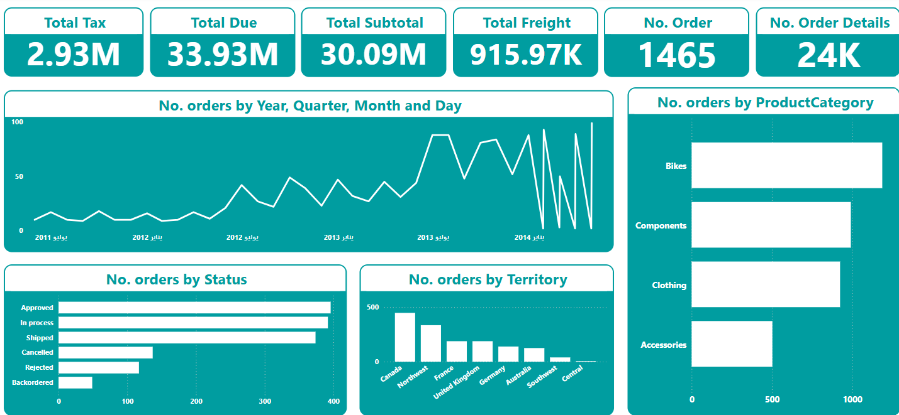

# 📊 E-Commerce Sales Analytics Dashboard

  
*Power BI/Tableau dashboard showing $2.93M tax, $33.93M due, and order distribution.*

## 🌟 Project Overview
An interactive business intelligence dashboard analyzing **1,465 orders** ($30.09M subtotal) for an e-commerce company. Tracks KPIs like taxes, freight costs, and order status across territories (UK, Australia, Canada) and product categories (Bikes, Clothing, etc.).

## 🔍 Key Metrics Visualized
- **Financial Summary**  
  ✅ Total Tax: $2.93M  
  ✅ Total Due: $33.93M  
  ✅ Freight Costs: $915.97K  

- **Order Distribution**  
  📅 Time Trends: 2011-2014 (July focus)  
  🚚 Status: Shipped (400+), Cancelled, Backordered  
  🗺️ Territories: North America, Europe, Australia  

- **Product Analysis**  
  🚲 Bikes (Highest volume)  
  👕 Clothing  
  🔧 Components  

## 🛠️ Technical Implementation
### Data Pipeline
```mermaid
graph LR
A[SQL Database] --> B[Power Query Transformations]
B --> C[Power BI Data Model]
C --> D[Interactive Visuals]